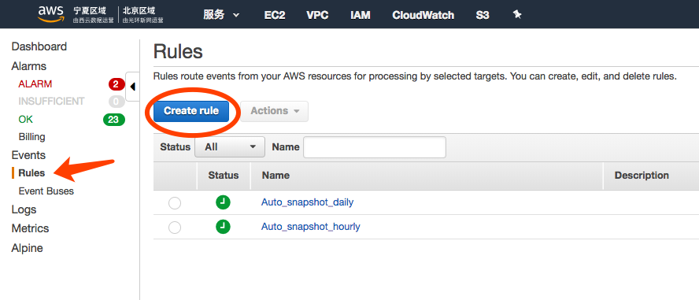
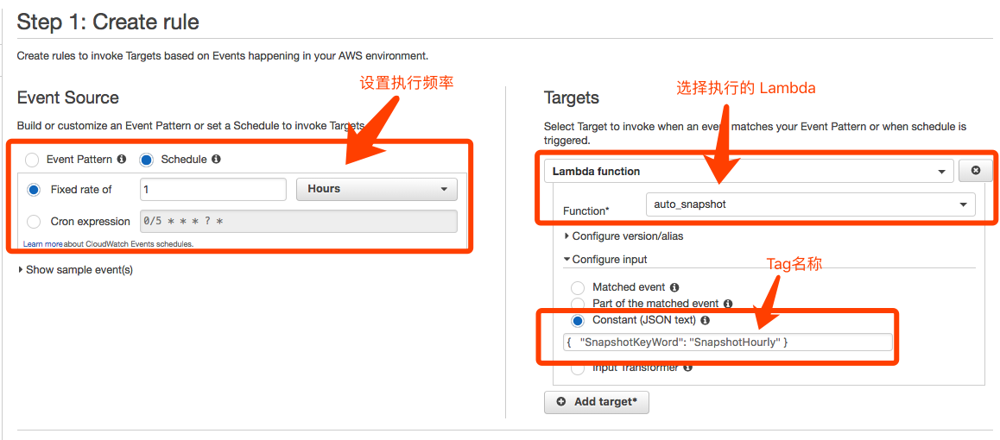
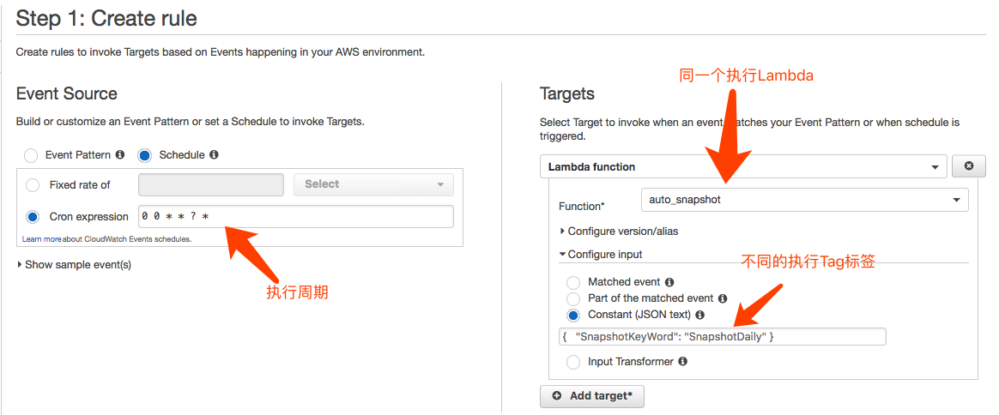
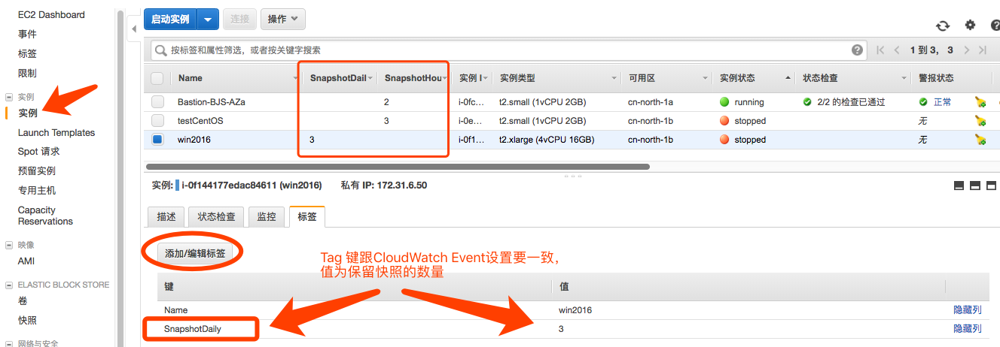
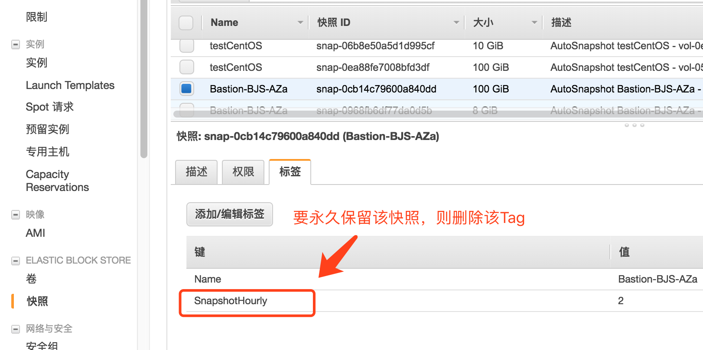

# EC2卷快照的生命周期管理  

本项目的目标是对EC2所挂载的EBS进行自动化的快照生命周期管理，包括：
* 根据EC2的Tag自动打EBS的快照
* 可以设定该EC2每个卷保留多少个最新的快照，老的快照自动删除
* 由CloudWatch定时任务自动触发Lambda实现
* 可以设置快照的间隔周期，或者设定某个具体时间，例如每天8点执行，可以有多个定时策略同时存在
* 可以手工保留某一个快照，不被自动删除。将该快照的Tag修改或删除即可。

1. 创建 Lambda 执行角色  
创建以下执行权限的角色，授信实体是 Lambda
```
{
    "Version": "2012-10-17",
    "Statement": [
        {
            "Sid": "VisualEditor0",
            "Effect": "Allow",
            "Action": [
                "logs:CreateLogStream",
                "ec2:DescribeInstances",
                "ec2:DeleteSnapshot",
                "ec2:CreateSnapshot",
                "ec2:CreateTags",
                "ec2:DescribeSnapshots",
                "logs:CreateLogGroup",
                "logs:PutLogEvents"
            ],
            "Resource": "*"
        }
    ]
}
```
对于生产环境，建议对Lambda中的执行失败发送通知，请增加SNS发送权限  

2. 创建 Lambda 函数  
   
* 开发语言选择 Python3.7 
* 执行角色选择前一步骤新建的角色
* Lambda超时时间，取决于要执行快照的实例多少，建议设置长一点，最大可设置15分钟
* Lambda执行内存，根据要执行快照的实例列表大小，数量不多的（10个以内），可以取默认的128MB
* 粘贴python代码，并保存  
  
    [auto_snapshot_lambda.py](./auto_snapshot_lambda.py)

** 代码详解 **
* 调用 EC2 的 describe_instances 接口查询所有实例，只过滤出 Tag 带 SnapshotKeyWord 标签的实例。SnapshotKeyWord 来自 CloudWatch Event 触发时候带过来。不同的定时执行计划，采用不同的 Tag ，调用的是同一个 Lambda 即可。
* 为有对应 Tag 的 EC2 的每个卷，调用接口 create_snapshot 进行快照，快照也打 Tag 带上 EC2 的所有 Tag。
* 调用 describe_snapshots 接口查询该卷的所有带对应 Tag 的快照，数一下如果超过EC2这个Tag所设定的值，则调用 delete_snapshot 删掉最老的几个快照。所以如果快照要长期保留，只要把快照的这个 Tag 去掉即可，没有了 Tag 那在 describe_snapshots 就会被过滤掉，不查出来。

3. 配置 CloudWatch 定时计划  
CloudWatch 控制台，新建 Event Rules



分别创建两条规则，一条是每小时执行一次，一条是每天执行一次：  

* 每小时执行一次  


Cron表达式的写法可以[参考文档](https://docs.amazonaws.cn/AmazonCloudWatch/latest/events/ScheduledEvents.html#CronExpressions)  
例如：  
每天中午12点(UTC)：0 12 * * ? *    
下一个示例创建从 2002 到 2005 年在每个月最后一个周五的上午 10:15 (UTC)：15 10 ? * 6L 2002-2005   
  
* 每天UTC时间0点执行一次，也就是北京时间8点


这个Tag名称是触发Lambda时区分对不同EC2进行不同频率快照的重要区分。

4. 对 EC2 实例打Tag(标签)  

* 对执行每小时快照一次的实例增加Tag：SnapshotHourly，Tag的值为保留快照的数量  
* 对执行每天快照一次的实例增加Tag：SnapshotDaily，Tag的值为保留快照的数量  



5. 永久保留某个快照  
   
以上设置之后，快照就会定时生成，并自动删除旧的。设置值为3，则会只保留3个快照。  
如果想手工地永久保留某个快照，则删除其Tag。该快照不会被删除，还会额外有3个快照。  



## 其他

* 代码中对快照没有启用加密，如果要加密，则在接口调用时加上相应参数
* Lambda 设置的超时时间，不应大于两次 Event 触发的间隔
* 考虑更完善的处理保护，应该在代码中的几个 TODO 位置加上对执行失败的通知 SNS 调用，发邮件通知管理员。另外，再加配置 Lambda 的 DLQ （死信队列）对执行失败通知 SNS。（注意增加Lambda的SNS调用权限）
* 查询 describe instance 的时候如果要考虑可能出现超过1000个匹配实例的情况的话，应该增加对返回结果 NextToken 的处理，以便获得完整的实例列表。
* 在2018年4月，Create Snapshot 接口支持了打快照的同时就打上 Tag ，本项目的代码得益于此功能，得到简化。注意在建Lambda执行角色的时候要配上 CreateTag 的权限。
